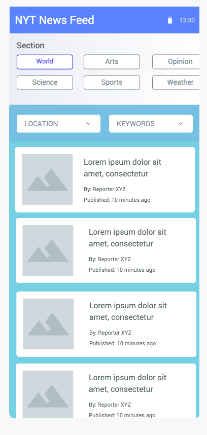

# React Native Developer Technical Test

The goal of this assignment is to build a news feed app. The app will display the “top stories” feed of the New York Times.

- The app should display an article list.
- The app should allow the user to switch between the different sections of top stories, e.g. science, travel or sports etc.
- The app should allow the user to quickly filter articles by location or description keywords.
- The app should be able to remember the section of the top stories selected by the user, so when the app is reopened the user can start where he left off.
- As this app will be used in remote areas it is important that the app is resilient to an unreliable network connection, i.e. offline capability.

## UI

## New York Times API

- <https://developer.nytimes.com/docs/top-stories-product/1/overview>
- <https://developer.nytimes.com/get-started>

## Env

In order to make it work need to provide **API_KEY** in **.env** file. I have not pushed it into this repo. Follow the links above to create the key.
